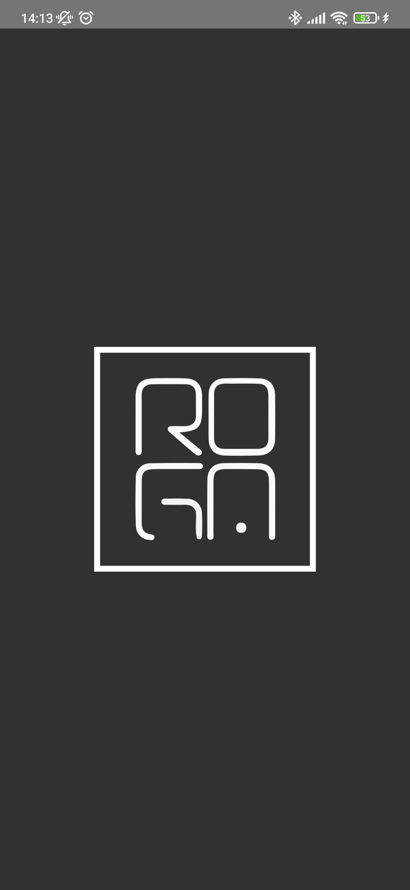
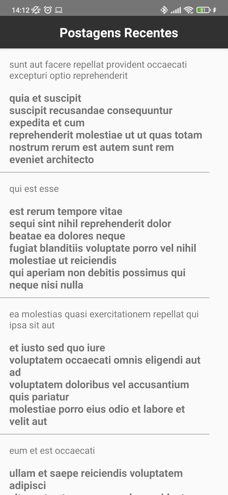
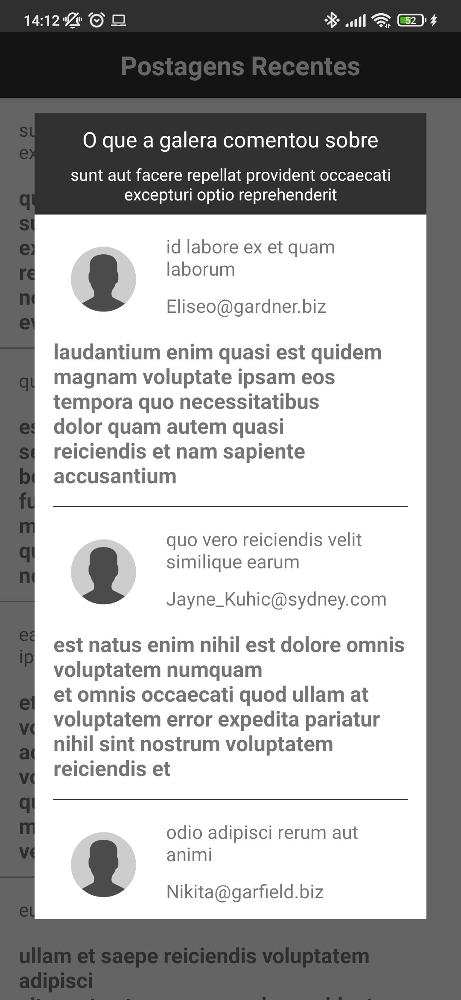

# android-case-roga-labs

Foi densenvolvido usando a arquitetura MVVM, foram utilizado as bibliotecas abaixo:

Koin Libary - Usada para implementar a injeção de dependencia;

Navigation library - Usada na implementação dos componentes de navegação;

Lifecycle library -  Usada para impementar a ViewModel/LiveData;

Retrofit library - Usada para implementação da transmissão de dados entre aplicação e webservice;

Gson library - Usada para a leitura dos arquivos Json enviados pela API;

 

